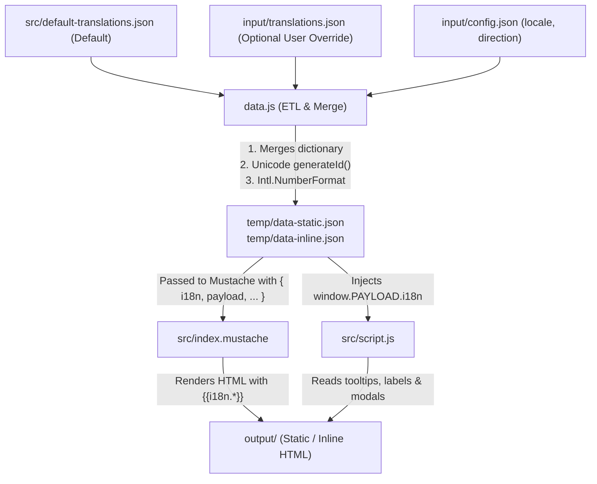
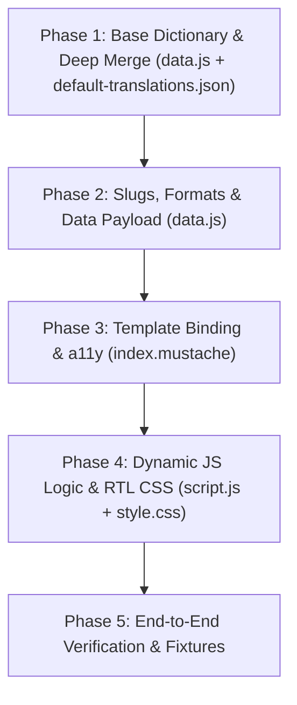

# Localization Implementation Plan (Zero Dependencies)

This document outlines a robust, zero-dependency localization (i18n/l10n) implementation for **jigsaw-sensemaking-generator**. It maintains the exact build, dev, and deployment workflows while enabling full UI translation, locale-aware formatting, and international script support.

---

## 1. Architecture & Data Flow



### Key Principles
1. **Zero New Dependencies**: Uses native Node.js built-ins (`node:fs`, `node:path`), modern ECMAScript standard library features (`Intl.NumberFormat`, Unicode RegExp `\p{L}`), and native Mustache data merging.
2. **Single Source of Truth**: All UI strings live in `src/default-translations.json`. Missing keys in user translations fallback automatically to English.
3. **No Build Pipeline Changes**: Works seamlessly across `npm run static`, `npm run inline`, `npm run preview`, and `npm run dev`.

---

## 2. File-by-File Implementation Plan

### A. Default Translation Dictionary: `src/default-translations.json`
Create a clean, categorized dictionary containing every string across HTML, charts, tooltips, and modals.

```json
{
  "locale": "en",
  "direction": "ltr",
  "meta": {
    "titlePrefix": "Jigsaw Sensemaking Report",
    "skipToMain": "Skip to main content",
    "openMenuAlt": "Open menu",
    "closeAlt": "Close",
    "copyLinkAlt": "Copy link",
    "logoAlt": "Logo"
  },
  "nav": {
    "executiveSummary": "Executive Summary",
    "conversationTopics": "Conversation Topics",
    "predictedAgreement": "Predicted Agreement"
  },
  "tabs": {
    "fullReport": "Full Report",
    "predictedAgreement": "Predicted Agreement"
  },
  "executiveSummary": {
    "title": "Executive Summary",
    "totalParticipants": "Total Participants",
    "topicsIdentified": "Topics Identified",
    "opinionsIdentified": "Opinions Identified"
  },
  "sections": {
    "participantOverview": "Participant Overview",
    "conversationOverview": "Conversation Overview",
    "conversationLeadTemplate": "Below is a high level overview of the topics discussed in the conversation. The most discussed topics were {topTopic1} and {topTopic2}.",
    "filterCompare": "Filter & Compare",
    "toggleViewLegend": "Toggle view by:",
    "allTopics": "All Topics",
    "topOpinions": "Top Opinions",
    "topicsIdentifiedBadge": "{count} topics identified",
    "opinionsBadge": "Opinions",
    "totalQuotesBadge": "Total quotes",
    "totalQuotesUnderline": "Total Quotes",
    "quotesCount": "{count} Quotes",
    "sampleQuotes": "Sample Quotes:",
    "viewAllQuotesAndDemographics": "View all quotes and demographics",
    "share": "Share",
    "shareModalTitle": "Share {title}",
    "copyLinkToShare": "Copy link to share",
    "close": "Close"
  },
  "predicted": {
    "title": "Predicted Agreement",
    "statementColumn": "Statement",
    "agreementColumn": "Predicted Agreement"
  },
  "drawer": {
    "participantQuotes": "Participant Quotes ({count})",
    "participantDemographics": "Participant Demographics",
    "noQuotes": "No quotes for the selected filters.",
    "unknownOpinion": "Unknown Opinion"
  },
  "filterModal": {
    "title": "Filter and Compare Demographics",
    "description": "Add multiple groups to compare demographic segments side by side, or use a single group to filter the main view.",
    "addGroup": "+ Add Group to Compare",
    "deleteGroup": "Delete group",
    "reset": "Reset",
    "applyFilters": "Apply Filters",
    "allParticipants": "All Participants",
    "groupLabelPrefix": "Group",
    "anyOption": "Any"
  },
  "chart": {
    "lowSampleSize": "Low sample size",
    "opinionsMeta": "({count} opinions)",
    "otherCategory": "Other"
  }
}
```

---

### B. Data & Localization Processing: `data.js`

1. **Load and Merge Translations**:
   ```javascript
   const defaultI18n = JSON.parse(fs.readFileSync("./src/default-translations.json", "utf-8"));
   const userI18nPath = `./input/${prefix}translations.json`;
   const userI18n = fs.existsSync(userI18nPath)
     ? JSON.parse(fs.readFileSync(userI18nPath, "utf-8"))
     : {};

   // Deep merge fallback: user keys override defaults
   const i18n = deepMerge(defaultI18n, userI18n);
   i18n.locale = config.locale || userI18n.locale || defaultI18n.locale || "en";
   i18n.direction = config.direction || userI18n.direction || defaultI18n.direction || "ltr";
   ```

2. **Fix `generateId` for Non-Latin / International Text**:
   Replace the ASCII-only regex with native Unicode property escapes:
   ```javascript
   function generateId(str, useFirstWords = false) {
     const words = str
       .split(" ")
       .slice(0, useFirstWords ? 5 : undefined)
       .join(" ");
     // Supports all Unicode letters, numbers, and cleans whitespace
     return words
       .toLowerCase()
       .normalize("NFD")
       .replace(/[\u0300-\u036f]/g, "") // Strip diacritics where applicable
       .replace(/[^\p{L}\p{N}]+/gu, "") || "item";
   }
   ```

3. **Locale-Aware Number Formatting**:
   ```javascript
   const numberFormatter = new Intl.NumberFormat(i18n.locale);
   function formatNumber(num) {
     return numberFormatter.format(num);
   }
   ```

4. **Dynamic Sentence Interpolation**:
   Interpolate sentences in `data.js` so translators can adjust word order for languages with different grammar (e.g., SOV languages):
   ```javascript
   const conversationOverviewLead = i18n.sections.conversationLeadTemplate
     .replace("{topTopic1}", topics[0]?.text || "")
     .replace("{topTopic2}", topics[1]?.text || "");
   ```
   *(Note: The executive summary paragraph was previously removed from `index.mustache`, eliminating the need for `executiveSummaryLead` template interpolation).*

5. **Pass `i18n` to Static/Inline Payloads & Mustache**:
   * Add `i18n` and computed summary strings (`conversationOverviewLead`) to `baseOutput`.
   * Include `i18n` inside `staticOutput.payload` and `inlineOutput.payload` so `window.PAYLOAD.i18n` is automatically populated for `src/script.js`.

---

### C. Template Updates: `src/index.mustache`

1. **HTML Lang and Direction**:
   ```mustache
   <html lang="{{i18n.locale}}" dir="{{i18n.direction}}">
   ```

2. **Replace Hardcoded Text & a11y Labels**:
   * Titles & Skip: `{{i18n.meta.titlePrefix}}`, `{{i18n.meta.skipToMain}}`
   * Navigation: `{{i18n.nav.executiveSummary}}`, `{{i18n.nav.conversationTopics}}`
   * Buttons & Toolbars: `{{i18n.sections.share}}`, `{{i18n.sections.filterCompare}}`
   * Summary Sentences: `{{{conversationOverviewLead}}}`
   * Badges & Counters: `{{i18n.sections.opinionsBadge}}`, `{{i18n.sections.totalQuotesBadge}}`
   * Drawers & Modals: `{{i18n.drawer.participantQuotes}}`, `{{i18n.filterModal.title}}`

---

### D. Frontend Client Logic: `src/script.js`

1. **Reference `window.PAYLOAD.i18n`**:
   ```javascript
   const i18n = window.PAYLOAD.i18n || {};
   const numberFormatter = new Intl.NumberFormat(i18n.locale || "en");
   ```

2. **Dynamic Tooltips & Labels**:
   * Low Sample Tooltip:
     ```javascript
     `<div class='low-sample'>${i18n.chart.lowSampleSize}</div>`
     ```
   * Quotes Count:
     ```javascript
     `${countFormatted} ${i18n.sections.quotesCount.replace("{count}", "").trim()}`
     ```
   * Topic Opinions Count:
     ```javascript
     `${refTopic.text} <span class="topic-meta">${i18n.chart.opinionsMeta.replace("{count}", refTopic.opinionCount)}</span>`
     ```
   * Filter Modal Group:
     ```javascript
     `${i18n.filterModal.groupLabelPrefix} ${GROUP_LABELS[i]}`
     ```
   * Drawer Empty State:
     ```javascript
     `<li>${i18n.drawer.noQuotes}</li>`
     ```
   * "Other" Demographic Handling:
     ```javascript
     const otherLabel = i18n.chart.otherCategory || "Other";
     if (a.value.toLowerCase() === otherLabel.toLowerCase()) return 1;
     ```

---

### E. Styling & Typography: `src/style.css`

1. **Universal Fallback Font Stack**:
   Update font variables in `:root` to support non-Latin scripts (Arabic, Cyrillic, CJK, Devanagari, Hebrew):
   ```css
   --serif: "Noto Sans", system-ui, -apple-system, BlinkMacSystemFont, "Segoe UI", Roboto, sans-serif;
   ```

2. **CSS Logical Properties for RTL Support**:
   Update icon margins and directional spacing:
   ```css
   button img, .button img, button svg, .button svg {
     margin-inline-end: 0.5rem;
   }
   ```

---

## 3. Configuration & User Workflow

Users who want to localize a report simply:
1. Place their translated `translations.json` into `input/translations.json` (or configure `"locale": "es"` in `input/config.json`).
2. Run standard commands:
   * `npm run static`
   * `npm run inline`
   * `npm run dev`

---

## 4. Verification & Testing Steps

| Test Case | Description | Verification Method |
| :--- | :--- | :--- |
| **Default English** | Run build without `translations.json` | Verify exact 1:1 match with current English UI |
| **Custom Language (e.g. Spanish/German)** | Provide `input/translations.json` | Check headings, tooltips, drawer, and modal strings |
| **Non-Latin Language (e.g. Arabic, Japanese)** | Test with UTF-8 topics and RTL | Verify `generateId()` produces valid links; check RTL rendering |
| **Number Formatting** | Test `locale: "de"` or `locale: "fr"` | Verify numbers show `1.000` or `1 000` separators |
| **Single-File Inlining** | Run `npm run inline` | Verify inlined `output/inline/index.html` renders translated text offline |

---

## 5. Step-by-Step Implementation & Code Review Guide

To ensure changes are easy to review, test, and reason about, the implementation is broken down into four atomic, self-contained phases. Each phase can be reviewed independently with zero regressions on existing functionality.



---

### Phase 1: Canonical Dictionary & Deep Merge Logic

#### What & Why
* Establish the single source of truth for all English UI strings in `src/default-translations.json`.
* Implement a robust, recursive deep merge utility in `data.js` so that user-provided `input/translations.json` can override specific strings without obliterating sibling properties in nested objects.

#### Files Changed
* `src/default-translations.json` (New file)
* `data.js` (Loading & merge logic)

#### Implementation Details
1. **Create `src/default-translations.json`**: Populate all categories (`meta`, `nav`, `tabs`, `executiveSummary`, `sections`, `predicted`, `drawer`, `filterModal`, `chart`).
2. **Implement Deep Merge in `data.js`**:
   ```javascript
   function deepMerge(target, source) {
     const output = { ...target };
     for (const key of Object.keys(source || {})) {
       if (
         source[key] instanceof Object &&
         key in target &&
         target[key] instanceof Object &&
         !Array.isArray(source[key])
       ) {
         output[key] = deepMerge(target[key], source[key]);
       } else if (source[key] !== undefined) {
         output[key] = source[key];
       }
     }
     return output;
   }

   const defaultI18n = JSON.parse(fs.readFileSync("./src/default-translations.json", "utf-8"));
   const userI18nPath = `./input/${prefix}translations.json`;
   const userI18n = fs.existsSync(userI18nPath)
     ? JSON.parse(fs.readFileSync(userI18nPath, "utf-8"))
     : {};

   const i18n = deepMerge(defaultI18n, userI18n);
   i18n.locale = config.locale || userI18n.locale || defaultI18n.locale || "en";
   i18n.direction = config.direction || userI18n.direction || defaultI18n.direction || "ltr";
   ```

#### Reviewer Checklist
- [ ] Verify `src/default-translations.json` contains valid JSON and covers all existing UI text.
- [ ] Confirm `deepMerge` handles nested keys without mutating sources.
- [ ] Verify that building without `input/translations.json` leaves default English values untouched.

---

### Phase 2: Unicode Slugging, Number Formatting & Payload Assembly

#### What & Why
* Fix `generateId()` so topics and opinions in non-Latin alphabets (Arabic, Hebrew, Chinese, Japanese, Cyrillic, Hindi, accented characters) generate valid anchor links instead of blank IDs.
* Replace hardcoded comma-regex number formatting with `Intl.NumberFormat`.
* Generate dynamic interpolated sentences (e.g. `conversationOverviewLead`).
* Inject `i18n` into `baseOutput`, `staticOutput.payload`, and `inlineOutput.payload`.

#### Simplifications Note
* Because the hardcoded executive summary paragraph was removed from `index.mustache`, we do **not** need complex sentence interpolation for `executiveSummaryLead`. Only `conversationOverviewLead` requires dynamic interpolation.

#### Files Changed
* `data.js`

#### Implementation Details
1. **Unicode Identifier Helper**:
   ```javascript
   function generateId(str, useFirstWords = false) {
     if (!str) return "item";
     const words = str
       .split(" ")
       .slice(0, useFirstWords ? 5 : undefined)
       .join(" ");
     return (
       words
         .toLowerCase()
         .normalize("NFD")
         .replace(/[\u0300-\u036f]/g, "") // Strip diacritics
         .replace(/[^\p{L}\p{N}]+/gu, "") || "item" // Preserve all Unicode letters/numbers
     );
   }
   ```
2. **Locale Number Formatter**:
   ```javascript
   const numberFormatter = new Intl.NumberFormat(i18n.locale);
   function formatNumber(num) {
     return numberFormatter.format(num);
   }
   ```
   *(Replace all calls to `addComma(x)` with `formatNumber(x)`).*
3. **Dynamic Sentence Interpolation**:
   ```javascript
   const conversationOverviewLead = i18n.sections.conversationLeadTemplate
     .replace("{topTopic1}", topics[0]?.text || "")
     .replace("{topTopic2}", topics[1]?.text || "");
   ```
4. **Demographic Label Sorting**:
   ```javascript
   demographics.sort((a, b) => a.label.localeCompare(b.label, i18n.locale));
   ```
5. **Attach to Payloads**:
   Include `i18n` and `conversationOverviewLead` in `baseOutput`, and ensure `staticOutput.payload` and `inlineOutput.payload` include `i18n`.

#### Reviewer Checklist
- [ ] Run `node data.js dev` and inspect `temp/data-static.json` to verify `i18n` and `conversationOverviewLead` are present.
- [ ] Test `generateId("مرحبا بكم")` and `generateId("Café Résumé")` to verify valid slug output.
- [ ] Confirm no NaN or undefined values in formatted counts.

---

### Phase 3: Mustache Template Binding & Accessibility

#### What & Why
* Bind all static UI strings, button labels, tooltips, and accessibility attributes in `src/index.mustache` to `{{i18n.*}}`.
* Add `lang` and `dir` attributes to `<html>` for screen readers and RTL text rendering.

#### Files Changed
* `src/index.mustache`

#### Key Replacements
| Original Hardcoded Markup | Localized Mustache Markup |
| :--- | :--- |
| `<html lang="en">` | `<html lang="{{i18n.locale}}" dir="{{i18n.direction}}">` |
| `<title>Jigsaw Sensemaking Report - {{hed}}</title>` | `<title>{{i18n.meta.titlePrefix}} - {{title}}</title>` |
| `<a href="#content" class="skip-to-main">Skip to main content</a>` | `<a href="#content" class="skip-to-main">{{i18n.meta.skipToMain}}</a>` |
| `<a ...>Executive Summary</a>` | `<a ...>{{i18n.nav.executiveSummary}}</a>` |
| `<p>Conversation Topics</p>` | `<p>{{i18n.nav.conversationTopics}}</p>` |
| `<h2>Executive Summary</h2>` | `<h2>{{i18n.executiveSummary.title}}</h2>` |
| `<strong>{{totalParticipants}}</strong> Total Participants` | `<strong>{{totalParticipants}}</strong> {{i18n.executiveSummary.totalParticipants}}` |
| `<strong>{{topicsIdentified}}</strong> Topics Identified` | `<strong>{{topicsIdentified}}</strong> {{i18n.executiveSummary.topicsIdentified}}` |
| `<strong>{{opinionsIdentified}}</strong> Opinions Identified` | `<strong>{{opinionsIdentified}}</strong> {{i18n.executiveSummary.opinionsIdentified}}` |
| `<p>Below is a high level overview...</p>` | `<p>{{{conversationOverviewLead}}}</p>` |
| `<span>Filter &amp; Compare</span>` | `<span>{{i18n.sections.filterCompare}}</span>` |
| `<div><span class="badge">...</span> Opinions</div>` | `<div><span class="badge">...</span> {{i18n.sections.opinionsBadge}}</div>` |
| `<div><span class="badge">...</span> Total quotes</div>` | `<div><span class="badge">...</span> {{i18n.sections.totalQuotesBadge}}</div>` |
| `<span class="underline">Total Quotes</span>` | `<span class="underline">{{i18n.sections.totalQuotesUnderline}}</span>` |
| `Participant Quotes (<span class="drawer-quote-count"></span>)` | `{{i18n.drawer.participantQuotesPrefix}} (<span class="drawer-quote-count"></span>)` |
| `<h2>Filter and Compare Demographics</h2>` | `<h2>{{i18n.filterModal.title}}</h2>` |

#### Reviewer Checklist
- [ ] Run `npm run static` with default English data.
- [ ] Diff the generated `output/static/index.html` against previous output to confirm exact text fidelity and no broken tags or missing variables.

---

### Phase 4: Frontend Dynamic Client Logic & RTL Styles

#### What & Why
* Update `src/script.js` to reference `window.PAYLOAD.i18n` for dynamically rendered tooltips, modal group names, and chart labels.
* Update `src/style.css` with non-Latin fallback fonts and CSS logical properties for smooth RTL layout transitions.

#### Files Changed
* `src/script.js`
* `src/style.css`

#### Implementation Details
1. **`src/script.js` Updates**:
   * Pull dictionary: `const i18n = window.PAYLOAD.i18n || {};`
   * Tooltip text: Replace `"Low sample size"` with `i18n.chart?.lowSampleSize || "Low sample size"`
   * Group label formatting: Replace `` `Group ${GROUP_LABELS[i]}` `` with `` `${i18n.filterModal?.groupLabelPrefix || "Group"} ${GROUP_LABELS[i]}` ``
   * Drawer empty state: Replace `"No quotes for the selected filters."` with `i18n.drawer?.noQuotes || "No quotes for the selected filters."`
   * Demographic "Other" detection: Match against `(i18n.chart?.otherCategory || "Other").toLowerCase()`
2. **`src/style.css` Updates**:
   * Add universal fallback font stack:
     ```css
     :root {
       --sans: "Noto Sans", system-ui, -apple-system, BlinkMacSystemFont, "Segoe UI", Roboto, Arial, sans-serif;
     }
     ```
   * Replace directional margins with CSS logical properties:
     ```css
     button img, .button img, button svg, .button svg {
       margin-inline-end: 0.5rem;
     }
     ```

#### Reviewer Checklist
- [ ] Open the report in a browser, trigger drawer opening and filter modal to verify dynamic labels render properly.
- [ ] Check browser console for any undefined reference errors.
- [ ] Verify icons and spacing look correct in both LTR and RTL orientations.

---

### Phase 5: Verification & End-to-End Validation

#### Reviewer Testing Commands

```bash
# 1. Test Default English Baseline (Regression Test)
npm run static
npm run inline

# 2. Test Custom Locale (e.g. Spanish)
# Create a test input/translations.json file with Spanish overrides:
# { "locale": "es", "direction": "ltr", "sections": { "filterCompare": "Filtrar y Comparar" } }
npm run static

# 3. Test RTL & Non-Latin (e.g. Arabic)
# Create input/translations.json with:
# { "locale": "ar", "direction": "rtl", "sections": { "share": "مشاركة" } }
npm run inline
```

#### Final Quality Gate
* [ ] Zero external dependencies added to `package.json`.
* [ ] Both `output/static/index.html` and `output/inline/index.html` build successfully.
* [ ] All tests pass: `pytest`.

